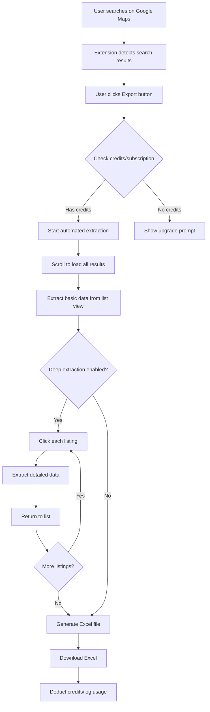
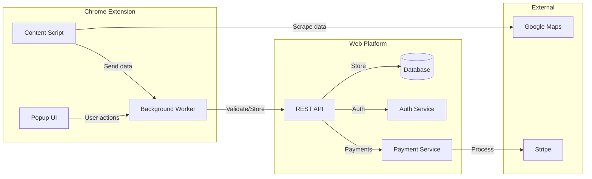
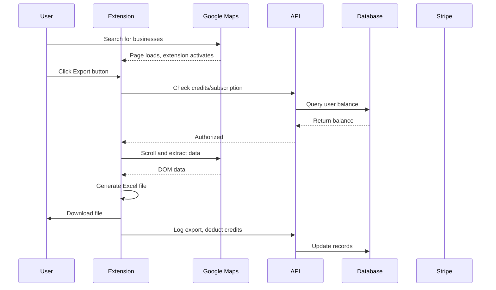
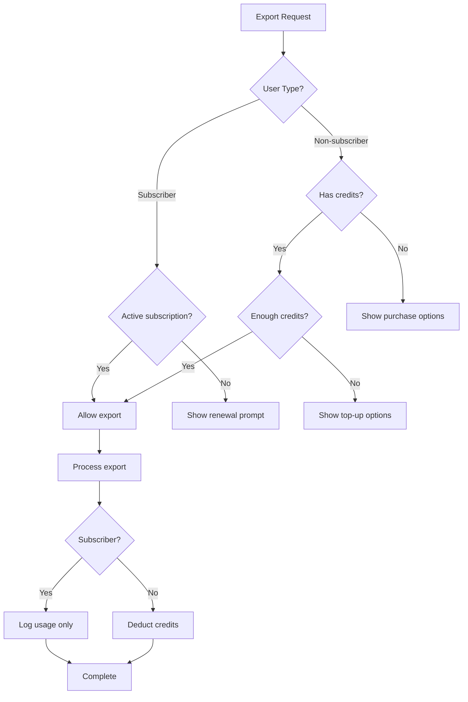
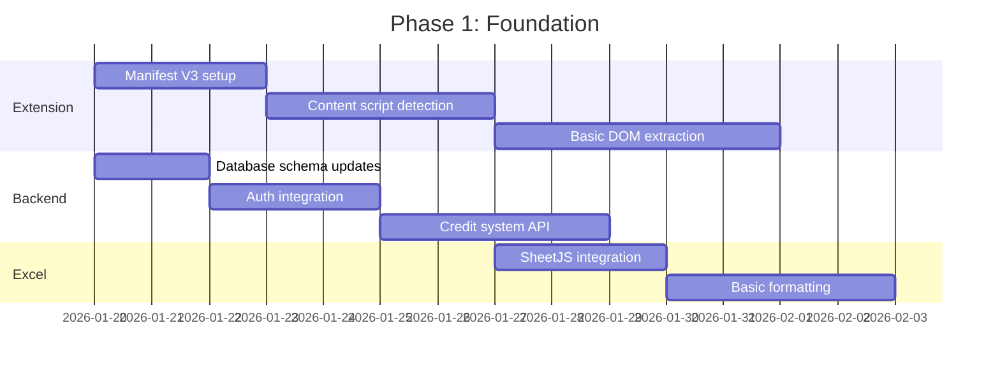

# Strategic Plan: GMB Excel Export - Local Competitor Data Extraction Tool

## Executive Summary

**Product Vision:** A Chrome extension that automates the extraction of comprehensive business data from Google Maps local search results and exports it to professionally formatted Excel spreadsheets. Targeting SEO agencies who need efficient competitor research tools.

**Core Value Proposition:** Transform hours of manual competitor research into minutes with automated data extraction and beautiful, client-ready Excel reports.

**Monetization Model:** 
- Non-subscribers: Credit-based pay-as-you-go
- Subscribers: Unlimited exports for a fixed monthly fee

---

## 1. Product Requirements and Features

### 1.1 Data Extraction Scope (Comprehensive)

Based on analysis of GMB Everywhere features and Google Maps data availability:

#### Tier 1: Basic Data (Available via Google Places API)
| Data Point | Source | Notes |
|------------|--------|-------|
| Business Name | API/DOM | Always available |
| Address | API/DOM | Full formatted address |
| Phone Number | API | Requires Place Details call |
| Website URL | API | Requires Place Details call |
| Rating | API/DOM | 1-5 star rating |
| Review Count | API/DOM | Total number of reviews |
| Primary Category | API | First type returned |
| Opening Hours | API | Weekly schedule |
| Place ID | API | Google's unique identifier |

#### Tier 2: Extended Data (Requires DOM Scraping)
| Data Point | Source | Notes |
|------------|--------|-------|
| Secondary Categories | DOM | All business categories |
| Services List | DOM | Services offered |
| Products | DOM | Products if listed |
| Attributes | DOM | Wheelchair accessible, LGBTQ+ friendly, etc. |
| Photos Count | DOM | Number of photos |
| Q&A Count | DOM | Questions and answers |
| CID | DOM | Customer ID for direct links |
| Knowledge Panel ID | DOM | For advanced linking |

#### Tier 3: Deep Data (Requires Individual Listing Clicks)
| Data Point | Source | Notes |
|------------|--------|-------|
| Individual Reviews | DOM | Full review text, author, date, rating |
| Review Keywords | Computed | Common words in reviews |
| Posts | DOM | Google Posts content |
| Post Frequency | Computed | Posts per month |
| Menu/Price List | DOM | If available |
| Booking Links | DOM | Appointment URLs |

### 1.2 Automation Behavior



**Automation Levels:**

1. **Quick Export** (1 credit per 20 businesses)
   - Extracts visible list data only
   - Basic info: name, address, rating, review count, category
   - No individual listing clicks
   - Fast: ~5 seconds for 20 results

2. **Standard Export** (1 credit per 10 businesses)
   - Scrolls to load all results (up to 60)
   - Extracts list view data
   - Includes secondary categories and attributes visible in list
   - Medium: ~30 seconds for 60 results

3. **Deep Export** (1 credit per 5 businesses)
   - Clicks into each listing
   - Extracts full reviews, posts, services, Q&A
   - Comprehensive data set
   - Slow: ~2-3 minutes for 20 results

### 1.3 User Interface

#### Chrome Extension Popup
- Export button with dropdown for export type
- Credit balance display
- Recent exports history
- Settings link

#### Floating Action Button (on Google Maps)
- Appears when search results are visible
- One-click export initiation
- Progress indicator during extraction

#### Web Dashboard
- Export history with re-download
- Credit purchase/subscription management
- Saved templates for Excel formatting
- Team management (Agency tier)

---

## 2. Technical Architecture

### 2.1 System Overview



### 2.2 Chrome Extension Architecture

#### Manifest V3 Structure
```
extension/
├── manifest.json
├── background/
│   └── service-worker.js      # Background service worker
├── content/
│   ├── maps-detector.js       # Detects Google Maps pages
│   ├── data-extractor.js      # DOM scraping logic
│   └── ui-injector.js         # Injects export buttons
├── popup/
│   ├── popup.html
│   ├── popup.js
│   └── popup.css
├── lib/
│   ├── excel-generator.js     # Client-side Excel creation
│   └── api-client.js          # Communication with backend
└── assets/
    └── icons/
```

#### Key Technical Considerations

1. **Manifest V3 Limitations**
   - Service workers replace background pages (no persistent state)
   - Limited to 5 minutes of execution time
   - Must use chrome.storage for persistence
   - Workaround: Chunk large extractions, use alarms for long operations

2. **Content Script Permissions**
   - Requires `*://www.google.com/maps/*` permission
   - Must handle dynamic content loading (MutationObserver)
   - Rate limiting to avoid detection/blocking

3. **Excel Generation**
   - Use SheetJS (xlsx) library for client-side generation
   - No server round-trip needed for file creation
   - Supports formatting, multiple sheets, charts

### 2.3 Web Dashboard Architecture

#### Technology Stack
| Component | Technology | Rationale |
|-----------|------------|-----------|
| Frontend | Next.js 14 | SSR, App Router, existing team knowledge |
| Backend | tRPC | Type-safe API, already in codebase |
| Database | PostgreSQL | Relational data, Drizzle ORM already configured |
| Auth | NextAuth.js | OAuth support, session management |
| Payments | Stripe | Industry standard, subscription + one-time |
| Hosting | Vercel | Easy deployment, edge functions |

#### Database Schema Additions

```sql
-- Users table (extend existing)
ALTER TABLE users ADD COLUMN credits INTEGER DEFAULT 0;
ALTER TABLE users ADD COLUMN subscription_tier VARCHAR(20);
ALTER TABLE users ADD COLUMN subscription_expires_at TIMESTAMP;

-- Exports table
CREATE TABLE exports (
    id UUID PRIMARY KEY DEFAULT gen_random_uuid(),
    user_id UUID REFERENCES users(id),
    search_query VARCHAR(255),
    location VARCHAR(255),
    business_count INTEGER,
    export_type VARCHAR(20), -- quick, standard, deep
    credits_used INTEGER,
    file_url VARCHAR(500),
    created_at TIMESTAMP DEFAULT NOW()
);

-- Credit transactions
CREATE TABLE credit_transactions (
    id UUID PRIMARY KEY DEFAULT gen_random_uuid(),
    user_id UUID REFERENCES users(id),
    amount INTEGER, -- positive for purchase, negative for usage
    type VARCHAR(20), -- purchase, usage, refund, bonus
    description VARCHAR(255),
    stripe_payment_id VARCHAR(100),
    created_at TIMESTAMP DEFAULT NOW()
);
```

### 2.4 Data Flow



---

## 3. Excel Generation and Formatting

### 3.1 Professional Excel Features

#### Sheet Structure
1. **Summary Sheet**
   - Search query and location
   - Export date and time
   - Total businesses found
   - Average rating across all
   - Category distribution chart

2. **Business Data Sheet**
   - All extracted data in columns
   - Conditional formatting for ratings
   - Hyperlinks for websites and Google Maps
   - Frozen header row
   - Auto-filter enabled

3. **Reviews Sheet** (Deep Export only)
   - Individual reviews with sentiment
   - Review date timeline
   - Rating distribution

4. **Analysis Sheet**
   - Pivot table ready data
   - Category breakdown
   - Rating distribution chart
   - Review count comparison

#### Formatting Specifications

| Element | Specification |
|---------|---------------|
| Header Row | Bold, dark blue background (#1a365d), white text |
| Rating Cells | Color scale: Red (1-2) → Yellow (3) → Green (4-5) |
| URLs | Blue, underlined, clickable hyperlinks |
| Column Width | Auto-fit with minimum 10, maximum 50 |
| Number Format | Ratings: 0.0, Review counts: #,##0 |
| Date Format | YYYY-MM-DD |
| Font | Calibri 11pt |
| Borders | Light gray gridlines |

#### Branding Options
- Company logo in header (configurable)
- Custom color scheme (Agency tier)
- White-label option (Enterprise)

### 3.2 Excel Generation Code Structure

```javascript
// lib/excel-generator.js (simplified)
import * as XLSX from 'xlsx';

export function generateExcel(data, options) {
    const workbook = XLSX.utils.book_new();
    
    // Summary sheet
    const summaryData = createSummarySheet(data, options);
    XLSX.utils.book_append_sheet(workbook, summaryData, 'Summary');
    
    // Business data sheet
    const businessSheet = createBusinessSheet(data.businesses);
    XLSX.utils.book_append_sheet(workbook, businessSheet, 'Businesses');
    
    // Reviews sheet (if deep export)
    if (options.includeReviews && data.reviews) {
        const reviewsSheet = createReviewsSheet(data.reviews);
        XLSX.utils.book_append_sheet(workbook, reviewsSheet, 'Reviews');
    }
    
    // Apply formatting
    applyProfessionalFormatting(workbook);
    
    return XLSX.write(workbook, { type: 'array', bookType: 'xlsx' });
}
```

---

## 4. Credit System and Monetization

### 4.1 Credit Structure

| Export Type | Credits per Business | Typical Export | Credits Used |
|-------------|---------------------|----------------|--------------|
| Quick | 0.05 | 20 businesses | 1 credit |
| Standard | 0.1 | 60 businesses | 6 credits |
| Deep | 0.2 | 20 businesses | 4 credits |

**Minimum charge:** 1 credit per export (even if fewer businesses)

### 4.2 Pricing Tiers

#### Credit Packs (Non-Subscribers)
| Pack | Credits | Price | Per Credit |
|------|---------|-------|------------|
| Starter | 50 | $9.99 | $0.20 |
| Standard | 150 | $24.99 | $0.17 |
| Pro | 500 | $69.99 | $0.14 |
| Agency | 2000 | $199.99 | $0.10 |

#### Subscription Plans
| Plan | Price/Month | Features |
|------|-------------|----------|
| **Free** | $0 | 5 Quick exports/month, basic formatting |
| **Pro** | $29/month | Unlimited exports, all export types, priority support |
| **Agency** | $79/month | Everything in Pro + team seats (5), white-label, API access |
| **Enterprise** | Custom | Custom limits, dedicated support, SLA |

**Annual Discount:** 20% off (Pro: $278/year, Agency: $758/year)

### 4.3 Credit System Implementation



### 4.4 Stripe Integration

**Products to Create:**
1. Credit packs (one-time purchases)
2. Pro subscription (monthly/annual)
3. Agency subscription (monthly/annual)

**Webhook Events to Handle:**
- `checkout.session.completed` - Add credits or activate subscription
- `invoice.paid` - Renew subscription
- `customer.subscription.deleted` - Downgrade to free
- `charge.refunded` - Remove credits

---

## 5. Competitive Analysis

### 5.1 Direct Competitors

| Tool | Price | Data Extraction | Excel Export | Automation |
|------|-------|-----------------|--------------|------------|
| **GMB Everywhere** | $29/mo | Comprehensive | Limited | Manual clicks |
| **BrightLocal** | $29-299/mo | API-based | Yes | Full |
| **LocalFalcon** | $24-249/mo | Rank tracking | Yes | Full |
| **Whitespark** | $33-417/mo | Citations focus | Yes | Partial |
| **PlePer** | Free-$49/mo | Basic | CSV only | Manual |

### 5.2 Competitive Advantages

1. **Automation Focus:** One-click extraction vs. manual clicking
2. **Beautiful Excel:** Professional formatting vs. raw data dumps
3. **Flexible Pricing:** Credits for occasional users, unlimited for power users
4. **Speed:** Client-side Excel generation, no server wait
5. **Comprehensive Data:** Deep extraction matches GMB Everywhere depth

### 5.3 Market Opportunity

**Target Market Size:**
- ~500,000 SEO professionals globally
- ~2 million small business owners doing DIY SEO
- Growing local SEO market ($75B by 2025)

**Addressable Market:**
- SEO agencies needing competitor research: 50,000+
- Estimated 10% conversion to paid: 5,000 customers
- Average revenue per customer: $300/year
- **TAM: $1.5M ARR potential in year 1**

---

## 6. Go-to-Market Strategy

### 6.1 Target Audience

**Primary:** SEO Agencies
- Need efficient competitor research
- Value time savings
- Willing to pay for quality tools
- Require client-ready deliverables

**Secondary:** Freelance SEO Consultants
- Price-sensitive but need professional tools
- Credit system appeals to variable workload
- Word-of-mouth marketing potential

**Tertiary:** Business Owners
- DIY competitor research
- Occasional use (credit packs)
- Lower lifetime value but high volume

### 6.2 Positioning

**Tagline:** "Export Google Maps Data to Excel in One Click"

**Key Messages:**
1. "Save hours of manual research"
2. "Client-ready Excel reports in seconds"
3. "The most comprehensive local business data extraction"

### 6.3 Launch Strategy

**Phase 1: Beta (Month 1-2)**
- Private beta with 100 SEO professionals
- Gather feedback on data accuracy and Excel formatting
- Iterate on UX and automation reliability

**Phase 2: Soft Launch (Month 3)**
- Chrome Web Store listing
- Product Hunt launch
- SEO community outreach (Reddit, Facebook groups)

**Phase 3: Growth (Month 4+)**
- Content marketing (tutorials, case studies)
- Affiliate program for SEO influencers
- Google Ads targeting local SEO keywords

### 6.4 Marketing Channels

| Channel | Strategy | Expected CAC |
|---------|----------|--------------|
| Organic Search | SEO blog content | $5-10 |
| Product Hunt | Launch campaign | $0 (organic) |
| Reddit/Communities | Value-first engagement | $0 (organic) |
| Google Ads | Targeted keywords | $20-40 |
| Affiliate | 20% commission | $30-50 |
| YouTube | Tutorial videos | $10-20 |

---

## 7. Implementation Roadmap

### Phase 1: Foundation (Weeks 1-4)



**Deliverables:**
- [ ] Chrome extension skeleton with Manifest V3
- [ ] Content script that detects Google Maps search results
- [ ] Basic data extraction (name, address, rating, reviews)
- [ ] Simple Excel export with basic formatting
- [ ] User authentication flow
- [ ] Credit balance tracking

### Phase 2: Core Features (Weeks 5-8)

**Deliverables:**
- [ ] Full automation (scroll, click, extract)
- [ ] All three export types (Quick, Standard, Deep)
- [ ] Professional Excel formatting
- [ ] Stripe payment integration
- [ ] Credit purchase flow
- [ ] Subscription management

### Phase 3: Polish and Launch (Weeks 9-12)

**Deliverables:**
- [ ] Web dashboard for export history
- [ ] Team management (Agency tier)
- [ ] Chrome Web Store submission
- [ ] Documentation and tutorials
- [ ] Beta testing with 100 users
- [ ] Bug fixes and performance optimization

### Phase 4: Growth Features (Post-Launch)

**Future Enhancements:**
- [ ] Scheduled/recurring exports
- [ ] API access for programmatic exports
- [ ] Custom Excel templates
- [ ] Integration with SEO tools (Ahrefs, SEMrush)
- [ ] Bulk location exports
- [ ] Historical data tracking

---

## 8. Risk Assessment and Mitigation

### 8.1 Technical Risks

| Risk | Likelihood | Impact | Mitigation |
|------|------------|--------|------------|
| Google Maps DOM changes | High | High | Modular selectors, quick update process, monitoring |
| Chrome extension rejection | Medium | High | Strict policy compliance, thorough review |
| Rate limiting/blocking | Medium | Medium | Randomized delays, user-agent rotation |
| Manifest V3 limitations | Low | Medium | Chunked operations, efficient state management |

### 8.2 Business Risks

| Risk | Likelihood | Impact | Mitigation |
|------|------------|--------|------------|
| Low conversion rate | Medium | High | Strong free tier, clear value demonstration |
| Competition from GMB Everywhere | High | Medium | Focus on Excel quality and automation |
| Google API changes | Low | High | Reduce API dependency, focus on DOM scraping |
| Pricing resistance | Medium | Medium | Credit system for flexibility, annual discounts |

### 8.3 Legal/Compliance Risks

| Risk | Likelihood | Impact | Mitigation |
|------|------------|--------|------------|
| Google ToS violation | Medium | Critical | Legal review, ethical scraping practices |
| GDPR compliance | Low | High | Data minimization, user consent, EU hosting option |
| Chrome Web Store policy | Medium | High | Regular policy review, conservative feature set |

### 8.4 Mitigation Strategies

1. **DOM Change Resilience**
   - Use multiple selector strategies (ID, class, aria-label)
   - Implement fallback extraction methods
   - Automated testing against live Google Maps
   - Rapid deployment pipeline for fixes

2. **Rate Limiting Protection**
   - Random delays between actions (2-5 seconds)
   - Respect robots.txt and rate limits
   - User-configurable extraction speed
   - Graceful degradation on detection

3. **Legal Protection**
   - Terms of service clearly stating data usage
   - No storage of extracted data on servers
   - User responsible for compliance with Google ToS
   - Regular legal review of practices

---

## 9. Success Metrics and KPIs

### 9.1 Product Metrics

| Metric | Target (Month 3) | Target (Month 6) | Target (Year 1) |
|--------|------------------|------------------|-----------------|
| Chrome Web Store installs | 5,000 | 25,000 | 100,000 |
| Monthly active users | 1,000 | 5,000 | 20,000 |
| Exports per user/month | 5 | 8 | 10 |
| Extension rating | 4.5+ stars | 4.5+ stars | 4.5+ stars |

### 9.2 Business Metrics

| Metric | Target (Month 3) | Target (Month 6) | Target (Year 1) |
|--------|------------------|------------------|-----------------|
| Paying customers | 100 | 500 | 2,000 |
| Monthly recurring revenue | $2,000 | $12,000 | $50,000 |
| Customer acquisition cost | $30 | $25 | $20 |
| Customer lifetime value | $150 | $200 | $300 |
| Churn rate | <10% | <8% | <5% |

### 9.3 Technical Metrics

| Metric | Target |
|--------|--------|
| Export success rate | >95% |
| Average export time (Quick) | <10 seconds |
| Average export time (Deep) | <3 minutes |
| Extension crash rate | <0.1% |
| API uptime | 99.9% |

---

## 10. What Needs to Change in Current Codebase

### 10.1 Code to Keep

| Component | Location | Reason |
|-----------|----------|--------|
| Database schema | `drizzle/schema.ts` | Extend for credits/exports |
| tRPC setup | `server/_core/trpc.ts` | Reuse for API |
| Auth hooks | `hooks/use-auth.ts` | Adapt for web dashboard |
| Business types | `data/mock-businesses.ts` | Use as data model |

### 10.2 Code to Modify

| Component | Current | Change Needed |
|-----------|---------|---------------|
| `server/features/gmb.ts` | Mobile app focused | Add export logging, credit deduction |
| `server/lib/google-maps.ts` | API-only | Add fallback for when extension provides data |
| `drizzle/schema.ts` | Basic user | Add credits, subscriptions, exports tables |

### 10.3 New Code Required

| Component | Purpose |
|-----------|---------|
| `extension/` | Entire Chrome extension codebase |
| `lib/excel-generator.ts` | Excel file generation |
| `server/features/credits.ts` | Credit management API |
| `server/features/exports.ts` | Export history API |
| `server/features/stripe.ts` | Payment processing |
| `app/dashboard/` | Web dashboard pages |

### 10.4 Code to Remove/Archive

| Component | Reason |
|-----------|--------|
| `app/(tabs)/` | Mobile-specific navigation |
| `components/ui/score-ring.tsx` | Mobile UI component |
| `app/gmb/index.tsx` | Mobile GMB interface |
| React Native dependencies | No longer needed |

---

## 11. Recommended Next Steps

1. **Validate the pivot** - Confirm this direction with stakeholders
2. **Create new repository** - Start fresh for Chrome extension + Next.js web app
3. **Build MVP extension** - Basic extraction and Excel export
4. **Set up Stripe** - Payment infrastructure
5. **Beta test** - 50-100 SEO professionals
6. **Iterate and launch** - Chrome Web Store submission

---

## Appendix A: Sample Excel Output

### Business Data Sheet Preview

| # | Business Name | Address | Phone | Website | Rating | Reviews | Category | Hours |
|---|---------------|---------|-------|---------|--------|---------|----------|-------|
| 1 | Smith Family Dentistry | 123 Main St, SF | (415) 555-0123 | [Link] | ⭐ 4.8 | 342 | Dentist | Mon-Fri 8-6 |
| 2 | Golden Gate Auto | 456 Market St, SF | (415) 555-0456 | [Link] | ⭐ 4.5 | 189 | Auto Repair | Mon-Sat 7-7 |

### Summary Sheet Preview

```
╔════════════════════════════════════════════════════════════╗
║  GMB Excel Export - Competitor Analysis Report             ║
╠════════════════════════════════════════════════════════════╣
║  Search Query: "dentist san francisco"                     ║
║  Location: San Francisco, CA                               ║
║  Export Date: 2026-01-16                                   ║
║  Total Businesses: 20                                      ║
║  Average Rating: 4.3                                       ║
║  Total Reviews: 2,847                                      ║
╚════════════════════════════════════════════════════════════╝
```

---

## Appendix B: Technical Specifications

### Chrome Extension Permissions

```json
{
  "permissions": [
    "storage",
    "activeTab",
    "downloads"
  ],
  "host_permissions": [
    "*://www.google.com/maps/*",
    "*://maps.google.com/*"
  ]
}
```

### API Endpoints

| Endpoint | Method | Purpose |
|----------|--------|---------|
| `/api/auth/session` | GET | Check authentication |
| `/api/credits/balance` | GET | Get credit balance |
| `/api/credits/purchase` | POST | Create Stripe checkout |
| `/api/exports/log` | POST | Log completed export |
| `/api/exports/history` | GET | Get export history |
| `/api/subscription/status` | GET | Check subscription |
| `/api/subscription/manage` | POST | Stripe customer portal |

---

*Document Version: 1.0*
*Last Updated: 2026-01-16*
*Author: Strategic Planning Team*
