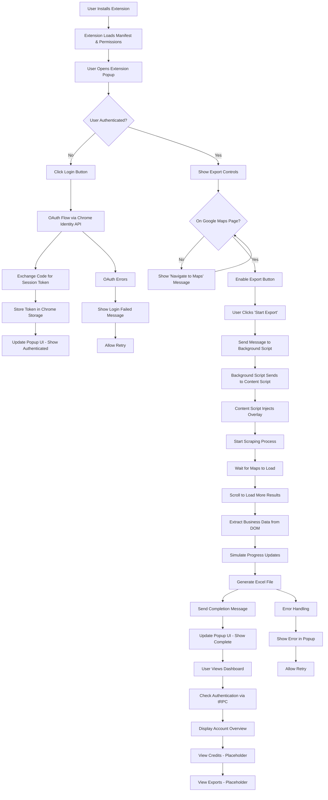

# GMB Excel Export MVP: User Flow Analysis and Code Issues

## User Flow Diagram

## Identified Code Issues

### Extension Issues

#### Critical Severity
1. **Excel Generation Fallback Implementation**
   - **Location**: `extension/scripts/excel.js`
   - **Issue**: Uses mock Excel export with alert() instead of real SheetJS library
   - **Impact**: No actual Excel files generated, breaks core functionality
   - **Fix**: Include SheetJS library in extension manifest and implement proper export

2. **DOM Scraping Selectors Hardcoded**
   - **Location**: `extension/scripts/scraper.js`
   - **Issue**: Google Maps DOM structure changes frequently, selectors may break
   - **Impact**: Scraping fails silently or returns incorrect data
   - **Fix**: Implement dynamic selector detection and fallback strategies

#### High Severity
3. **Content Script Injection Timing**
   - **Location**: `extension/content.js`
   - **Issue**: Uses DOMContentLoaded, but Google Maps loads content dynamically
   - **Impact**: Content script may not be ready when user starts export
   - **Fix**: Use MutationObserver to detect when Maps content is loaded

4. **No Error Recovery for Failed Scraping**
   - **Location**: `extension/scripts/scraper.js`
   - **Issue**: If scraping fails partway through, no retry mechanism
   - **Impact**: Partial data loss, user confusion
   - **Fix**: Implement chunked scraping with resume capability

5. **Message Passing Race Conditions**
   - **Location**: `extension/background.js`, `extension/content.js`
   - **Issue**: Async message handling without proper sequencing
   - **Impact**: Commands may be lost or processed out of order
   - **Fix**: Add message queuing and acknowledgment system

#### Medium Severity
6. **Hardcoded API URLs**
   - **Location**: `extension/background.js`, `extension/scripts/auth.js`
   - **Issue**: API base URL hardcoded to localhost:3000
   - **Impact**: Won't work in production environment
   - **Fix**: Make configurable via extension settings

7. **No Rate Limiting for API Calls**
   - **Location**: `extension/background.js`
   - **Issue**: No protection against rapid OAuth attempts
   - **Impact**: Potential abuse or API quota exhaustion
   - **Fix**: Implement cooldown periods and attempt limits

8. **Popup State Not Persisted**
   - **Location**: `extension/popup.js`
   - **Issue**: Popup state resets on reopen
   - **Impact**: User loses context of ongoing operations
   - **Fix**: Persist state in chrome.storage.local

#### Low Severity
9. **Console Logging in Production**
   - **Location**: All extension files
   - **Issue**: Extensive console.log statements
   - **Impact**: Performance, potential information leakage
   - **Fix**: Implement proper logging levels and remove debug logs

10. **No Extension Update Handling**
    - **Location**: `extension/manifest.json`
    - **Issue**: No migration logic for storage/data updates
    - **Impact**: Data corruption on extension updates
    - **Fix**: Add version checking and data migration

### Backend Issues

#### High Severity
11. **No Database Connection Error Handling**
    - **Location**: `server/db.ts`, various routers
    - **Issue**: Database failures not gracefully handled
    - **Impact**: API calls fail silently or crash
    - **Fix**: Implement connection pooling and retry logic

12. **tRPC Error Responses Inconsistent**
    - **Location**: `server/routers.ts`, various features
    - **Issue**: Error handling varies across endpoints
    - **Impact**: Frontend error handling difficult
    - **Fix**: Standardize error response format

#### Medium Severity
13. **OAuth State Parameter Not Validated**
    - **Location**: `server/_core/oauth.ts`
    - **Issue**: State parameter used for security not properly validated
    - **Impact**: Potential CSRF vulnerabilities
    - **Fix**: Implement proper state validation

14. **Session Token Expiration Not Handled**
    - **Location**: `server/_core/cookies.ts`
    - **Issue**: No automatic token refresh mechanism
    - **Impact**: Users unexpectedly logged out
    - **Fix**: Implement refresh token flow

15. **No Rate Limiting on API Endpoints**
    - **Location**: All API routes
    - **Issue**: No protection against abuse
    - **Impact**: Potential DoS attacks or quota exhaustion
    - **Fix**: Implement rate limiting middleware

#### Low Severity
16. **CORS Configuration Too Permissive**
    - **Location**: Extension manifest host_permissions
    - **Issue**: Allows all Google Maps subdomains
    - **Impact**: Potential security risk
    - **Fix**: Restrict to specific required domains

17. **No Request Logging**
    - **Location**: `server/_core/index.ts`
    - **Issue**: No audit trail for API usage
    - **Impact**: Difficult debugging and monitoring
    - **Fix**: Add request logging middleware

### Dashboard Issues

#### High Severity
18. **Placeholder Pages Not Implemented**
    - **Location**: `dashboard/app/exports/page.tsx`, `dashboard/app/credits/page.tsx`
    - **Issue**: Core features show "coming soon" messages
    - **Impact**: Users cannot manage exports or credits
    - **Fix**: Implement full functionality using tRPC routers

19. **No Error Boundaries**
    - **Location**: `dashboard/app/layout.tsx`
    - **Issue**: Unhandled errors crash the app
    - **Impact**: Poor user experience
    - **Fix**: Add React Error Boundaries

#### Medium Severity
20. **Loading States Not Comprehensive**
    - **Location**: `dashboard/app/page.tsx`
    - **Issue**: Only basic loading spinner for auth
    - **Impact**: Users unsure of app state
    - **Fix**: Add loading states for all async operations

21. **No Offline Handling**
    - **Location**: All dashboard pages
    - **Issue**: No offline detection or cached data
    - **Impact**: App unusable when network fails
    - **Fix**: Implement service worker and offline capabilities

22. **Authentication State Sync Issues**
    - **Location**: `dashboard/app/page.tsx`
    - **Issue**: Auth check only on mount, not reactive
    - **Impact**: UI doesn't update if session expires
    - **Fix**: Implement real-time auth state monitoring

#### Low Severity
23. **No Keyboard Navigation**
    - **Location**: All dashboard components
    - **Issue**: Not accessible via keyboard
    - **Impact**: Accessibility issues
    - **Fix**: Add proper ARIA labels and keyboard handlers

24. **No Dark Mode Support**
    - **Location**: `dashboard/app/globals.css`
    - **Issue**: Only light theme
    - **Impact**: Poor UX in different environments
    - **Fix**: Implement theme switching

## Recommended Fixes and Priorities

### Phase 1: Critical Fixes (Must Fix Before Launch)
1. Implement real Excel export using SheetJS
2. Fix DOM scraping selectors with dynamic detection
3. Implement proper content script timing with MutationObserver
4. Complete exports and credits dashboard pages

### Phase 2: High Priority Fixes (Fix Within First Week)
5. Add error recovery for scraping failures
6. Implement message passing reliability improvements
7. Add database connection error handling
8. Standardize tRPC error responses
9. Add React Error Boundaries to dashboard

### Phase 3: Medium Priority Fixes (Fix Within First Month)
10. Make API URLs configurable
11. Add rate limiting for OAuth
12. Implement popup state persistence
13. Add OAuth state validation
14. Implement session token refresh
15. Add comprehensive loading states

### Phase 4: Low Priority Fixes (Future Enhancements)
16. Remove production console logs
17. Add extension update migration logic
18. Restrict CORS permissions
19. Add request logging
20. Implement offline handling
21. Add keyboard navigation
22. Implement dark mode

## Testing Checklist

### Installation & Setup
- [ ] Extension installs without errors
- [ ] All required permissions granted
- [ ] Content scripts inject properly on Google Maps
- [ ] Background service worker starts successfully

### Authentication Flow
- [ ] Login button initiates OAuth flow
- [ ] Chrome Identity API handles redirect correctly
- [ ] Authorization code exchanges for session token
- [ ] Token stored in chrome.storage.local
- [ ] Popup updates to show authenticated state
- [ ] Dashboard recognizes authenticated user

### Business Discovery
- [ ] Extension detects Google Maps pages correctly
- [ ] Content script loads when Maps content changes
- [ ] Scraping waits for Maps to fully load
- [ ] Scroll loading works to get more results
- [ ] Business data extraction handles various DOM structures

### Data Export
- [ ] Export button enabled only on Maps pages when authenticated
- [ ] Start export sends correct messages through background
- [ ] Progress updates display in popup
- [ ] Excel file generates with correct data structure
- [ ] File downloads automatically or shows success message
- [ ] Export completion updates popup UI

### Error Handling
- [ ] Network failures during OAuth show appropriate messages
- [ ] Scraping failures provide retry options
- [ ] Excel generation errors display user-friendly messages
- [ ] Authentication expiration prompts re-login

### Credit Management
- [ ] Dashboard shows current credit balance
- [ ] Credit purchase flow works (when implemented)
- [ ] Credit deduction on export (when implemented)
- [ ] Insufficient credits shows appropriate warning

### Dashboard Usage
- [ ] Authentication state syncs between extension and dashboard
- [ ] Export history displays correctly
- [ ] Download links work for completed exports
- [ ] Settings page allows configuration changes

## Risk Assessment and Mitigation

### High Risk Issues
1. **Google Maps DOM Changes**: Mitigate by implementing robust selector fallbacks and monitoring
2. **OAuth Flow Failures**: Mitigate by adding retry logic and clear error messages
3. **Excel Export Failures**: Mitigate by implementing proper SheetJS integration and fallback formats

### Medium Risk Issues
4. **Database Connection Issues**: Mitigate by implementing connection pooling and health checks
5. **Session Management Problems**: Mitigate by adding token refresh and proper expiration handling
6. **Extension Permission Issues**: Mitigate by clear documentation and graceful degradation

### Low Risk Issues
7. **UI/UX Problems**: Mitigate by user testing and iterative improvements
8. **Performance Issues**: Mitigate by code optimization and monitoring
9. **Security Vulnerabilities**: Mitigate by regular security audits and updates

### Contingency Plans
- **Complete System Failure**: Have manual export process documented
- **Google API Changes**: Maintain alternative data sources
- **Extension Store Rejection**: Prepare appeal with technical documentation
- **User Data Loss**: Implement regular backups and recovery procedures

This analysis provides a comprehensive foundation for finalizing the GMB Excel Export MVP. The identified issues should be addressed in priority order to ensure a stable and reliable product launch.